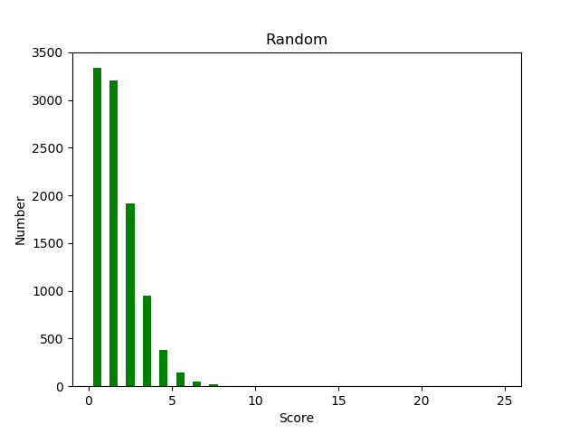

# IN104 - Rapport du projet Hanabi

Auteurs : Quach Christine - Gregorio Nina    
Lien github de notre projet : https://github.com/Naiina/Christine_Quach_Nina_Gregorio_Hanabi

## Stratégie retenue
### IA Aleatoire
- Nous avons d'abord crée une IA qui joue de façon aléatoire afin de nnous familiarise avec les classes AI, Deck, Hand et Game.

### IA non-tricheuse
- Nous avons ensuite choisi de modifier l'IA Cheater en faisant en sorte qu'elle ne triche plus. Pour cela il a fallu modifier :
	- Les listes playable, discardable, precious, mynotprecious, myprecious, pour avoir seulement les listes des cartes pour lesquelles l'IA a recu des indices (que l'IA conait). 
- Puis nous avons apporté des ameliorations de strategie. Notamment :
	- Des le debut de partie, en prioriter, donner l'indice 1 ou jouer les cartes 1.
	- Jouer uniquement les cartes dont on est 100% surs

### IA de recommandation
- Nous avons  decidé d'ameliorer notre IA non-tricheuse avec la strategie de Recommendation détaillé dans l'article. Pour cela nous avons opte pour la structure de code suivant :
	- 1) Fonction aui decide de la meilleur action a faire pour chaque main.
	- 2) Fonction qui permet de donner l'indice aui serait une recommandatio pour les 4 autres joueurs.
	- 3) Fonction qui permet l'interpretation de cette indice.
	- 4) Fonction qui decide de l'action effectivement effectuee.
	
### IA de recommandation optimisee
- Enfin nous avons tente d'optimiser cette IA, en apportant des modifications de strategie : 
	- Les indices n'etant pas exploités au maximum, nous avons choisi d'indiquer également le nombre de joueurs pouvant jouer de façon simultané afin d'optimiser l'utilisation des indices
	- En début de partie, afin de pousser les joueurs qui peuvent le faire à jeter lorsqu'il n'y a plus beaucoup d'indices, on divise le jeux en deux phases: 
		- Dans la première : s'il ne reste que deux jetons et qu'un joueur peut jeter une carte, il le fait au lieu de donner un indice. 
		- Dans la deuxième : il donne préférentiellement un indice.


## Points techniques
### Listes triees
Pour recommander les cartes par priorite d'anciennete ou de rang on utilise la syntaxe suivante :
```python
    #on trie les cartes par ordre decroissant de rang, et par anciennete les plus anciennes avant
        playable.sort(key=lambda p: (-p[1],p[0]))

```

### Fonction deduce_number : Conversion indice chiffre en chaine de caracteres 
Pour convertir un indice d'action en un chiffre, nous avons utilise le tableau suivant : 
| action | indice_chiffre |  p/d | carte |
| - | - | - | - |
| p1 | 0 | -1 | 1 |
| p2 | 1 | -1 | 2 |
| p3 | 2 | -1 | 3 |
| p4 | 3 | -1 | 4 |
| d1 | 4 | 3 | 1 |
| d2 | 5 | 3 | 2 |
| d3 | 6 | 3 | 3 |
| d4 | 7 | 3 | 4 |

On associe l'action 'p' au chiffre 0 et 'd' a 3. 
```python
    #Numero 1 : Si dans la liste playable et non vide il y en a une de rang 5 on la joue, si il y en a plusieur on joue 
            #la plus petite d'indice.
    R=[0,0]

        if playable: 
            R[0]=(-1)

        #CAS NUMERO 1 
            #on trie les cartes par ordre decroissant de rang, et par anciennete les plus anciennes avant
            playable.sort(key=lambda p: (-p[1],p[0]))
            if playable[0][1]==5 :
                R[1]=playable[0][0]
                print (R[0]+R[1])
                return (R[0]+R[1])        
```

On utilise l'indice de type int pour chercher directement son equivalent en chaine de caractere dans la liste.
| hint | indice a donner |
| - | - |
| 0 | c11 |
| 1 | c12 |
| 2 | c13 |
| 3 | c14 |
| 4 | cr1 |
| 5 | cr2 |
| 6 | cr3 |
| 7 | cr4 |

```python
    IND=['c11','c12','c13','c14','cr1','cr2','cr3','cr4']
        A=IND[hint]
```

### Algo RecommendationStrategy
 	- Ajout dans deck d'une liste mémoire afin que les joueurs puissent mémoriser au moment où est donné l'indice ce qu'ils doivent faire.
	- Utilisation de sefl.game.moves pour déduir quel est le numéro du joueur en cours, combien de cartes ont éte jouées depuis le dernier indice, quel est le dernier indice donné.
	- Des fonctions qui fond les conversions entre les indices en string du type "c1A" les indices en int entre 0 et 7 et ce qu'ils représentent pour le joueur dont c'est le tour en fonction de quand ils ont étés données, afin de ne pas se mélanger dans touuus ces indices différents
	- Un fichier pour lancer le jeu en une ligne de commende au lieu de 4

### Algo RecommendationStrategy_3
	- Une liste qui tient compte du nombre de joueurs pouvant jouer d'affilé pour optimiser l'algo précédent (nécéssité de modifier la maorité des fonctions en conséquence)


## Tests unitaires ou de non-régression
### Test unitaire : give_a_hint 
On verifie, a travers ce test, que l'indice qui est donne est le bon. 
Voici la configuration dans laquelle on se place pour realiser ce test : 

```python
    def test_give_a_hint_2(self):
        game = hanabi.Game(5)
        RS=hanabi.ai.RecommendationStrategy(game) 
        c1 = hanabi.deck.Card(hanabi.deck.Color.Blue,2)
        c2 = hanabi.deck.Card(hanabi.deck.Color.Blue,1)
        c3 = hanabi.deck.Card(hanabi.deck.Color.Green,1)
        c4 = hanabi.deck.Card(hanabi.deck.Color.Yellow,1)

        c5 = hanabi.deck.Card(hanabi.deck.Color.Red,1)
        c6 = hanabi.deck.Card(hanabi.deck.Color.Blue,5)
        c7 = hanabi.deck.Card(hanabi.deck.Color.Green,5)
        c8 = hanabi.deck.Card(hanabi.deck.Color.Yellow,5)

        c9 = hanabi.deck.Card(hanabi.deck.Color.Red,1)
        c10 = hanabi.deck.Card(hanabi.deck.Color.Green,2)
        c11 = hanabi.deck.Card(hanabi.deck.Color.Blue,1)
        c12  = hanabi.deck.Card(hanabi.deck.Color.Green,1)

        c13 = hanabi.deck.Card(hanabi.deck.Color.Green,4)
        c14 = hanabi.deck.Card(hanabi.deck.Color.Yellow,1)
        c15 = hanabi.deck.Card(hanabi.deck.Color.Yellow,2)
        c16 = hanabi.deck.Card(hanabi.deck.Color.Red,5)

        c17 = hanabi.deck.Card(hanabi.deck.Color.Green,3)
        c18 = hanabi.deck.Card(hanabi.deck.Color.Yellow,3)
        c19 = hanabi.deck.Card(hanabi.deck.Color.Red,4)
        c20 = hanabi.deck.Card(hanabi.deck.Color.Blue,4)

        game.piles[hanabi.deck.Color.Blue]=1
        game.piles[hanabi.deck.Color.Red]=1
        game.piles[hanabi.deck.Color.Green]=1
        game.piles[hanabi.deck.Color.Yellow]=1

        ok1=hanabi.deck.Deck([c1,c2,c3,c4]) 
        hand1 = hanabi.deck.Hand(ok1, 4)
        ok2=hanabi.deck.Deck([c5,c6,c7,c8])
        hand2 = hanabi.deck.Hand(ok2, 4) 
        ok3=hanabi.deck.Deck([c9,c10,c11,c12])
        hand3 = hanabi.deck.Hand(ok3, 4)
        ok4=hanabi.deck.Deck([c13,c14,c15,c16])
        hand4 = hanabi.deck.Hand(ok4, 4)
        ok5=hanabi.deck.Deck([c17,c18,c19,c20])
        hand5 = hanabi.deck.Hand(ok5, 4)
        hanabi.ai.RecommendationStrategy.other_hands=[hand1,hand2,hand3,hand4]
        self.assertEqual(hanabi.ai.RecommendationStrategy.give_a_hint(RS), 'cr4')

```

### Test unitaire : deduce_my_moves 
On reprend la meme configuration et on teste si le joueur 2 a bien interprete son indice.
Voici la configuration dans laquelle on se place pour realiser ce test : 

```python
    def test_deduce_my_moves_2(self):  
        game = hanabi.Game(5)
        RS=hanabi.ai.RecommendationStrategy(game) 
        c1 = hanabi.deck.Card(hanabi.deck.Color.Blue,2)
        c2 = hanabi.deck.Card(hanabi.deck.Color.Blue,1)
        c3 = hanabi.deck.Card(hanabi.deck.Color.Green,1)
        c4 = hanabi.deck.Card(hanabi.deck.Color.Yellow,1)

        c5 = hanabi.deck.Card(hanabi.deck.Color.Red,1)
        c6 = hanabi.deck.Card(hanabi.deck.Color.Blue,5)
        c7 = hanabi.deck.Card(hanabi.deck.Color.Green,5)
        c8 = hanabi.deck.Card(hanabi.deck.Color.Yellow,5)

        c9 = hanabi.deck.Card(hanabi.deck.Color.Red,1)
        c10 = hanabi.deck.Card(hanabi.deck.Color.Green,2)
        c11 = hanabi.deck.Card(hanabi.deck.Color.Blue,1)
        c12  = hanabi.deck.Card(hanabi.deck.Color.Green,1)

        c13 = hanabi.deck.Card(hanabi.deck.Color.Green,4)
        c14 = hanabi.deck.Card(hanabi.deck.Color.Yellow,1)
        c15 = hanabi.deck.Card(hanabi.deck.Color.Yellow,2)
        c16 = hanabi.deck.Card(hanabi.deck.Color.Red,5)

        c17 = hanabi.deck.Card(hanabi.deck.Color.Green,3)
        c18 = hanabi.deck.Card(hanabi.deck.Color.Yellow,3)
        c19 = hanabi.deck.Card(hanabi.deck.Color.Red,4)
        c20 = hanabi.deck.Card(hanabi.deck.Color.Blue,4)

        game.piles[hanabi.deck.Color.Blue]=1
        game.piles[hanabi.deck.Color.Red]=1
        game.piles[hanabi.deck.Color.Green]=1
        game.piles[hanabi.deck.Color.Yellow]=1

        ok1=hanabi.deck.Deck([c1,c2,c3,c4]) 
        hand1 = hanabi.deck.Hand(ok1, 4)
        ok2=hanabi.deck.Deck([c5,c6,c7,c8])
        hand2 = hanabi.deck.Hand(ok2, 4) 
        ok3=hanabi.deck.Deck([c9,c10,c11,c12])
        hand3 = hanabi.deck.Hand(ok3, 4)
        ok4=hanabi.deck.Deck([c13,c14,c15,c16])
        hand4 = hanabi.deck.Hand(ok4, 4)
        ok5=hanabi.deck.Deck([c17,c18,c19,c20])
        hand5 = hanabi.deck.Hand(ok5, 4)
        hanabi.ai.RecommendationStrategy.other_hands=[hand3,hand4,hand5,hand1]
        self.assertEqual(hanabi.ai.RecommendationStrategy.deduce_my_moves(RS,'cr4',3), 'd1')
```

### Test unitaire : play 
On verifie que si une carte a deja ete jouee depuis que le dernier indice a ete donne et qu'il y a deja 2 jetons rouge, l'IA choisit l'action de donner un indice. On verifie egalement qu'elle donne le bon indice. 
Voici la configuration dans laquelle on se place pour realiser ce test : 

```python
	def test_play(self):
        game = hanabi.Game(5)
        RS=hanabi.ai.RecommendationStrategy(game)

        c1 = hanabi.deck.Card(hanabi.deck.Color.Green,1)
        c2 = hanabi.deck.Card(hanabi.deck.Color.Blue,4)
        c3 = hanabi.deck.Card(hanabi.deck.Color.Green,4)
        c4 = hanabi.deck.Card(hanabi.deck.Color.Red,4)

        c5 = hanabi.deck.Card(hanabi.deck.Color.Red,1)
        c6 = hanabi.deck.Card(hanabi.deck.Color.Green,5)
        c7 = hanabi.deck.Card(hanabi.deck.Color.Blue,5)
        c8 = hanabi.deck.Card(hanabi.deck.Color.Red,5)

        c9 = hanabi.deck.Card(hanabi.deck.Color.Yellow,1)
        c10 = hanabi.deck.Card(hanabi.deck.Color.Yellow,4)
        c11 = hanabi.deck.Card(hanabi.deck.Color.Blue,4)
        c12 = hanabi.deck.Card(hanabi.deck.Color.Red,4)

        c13 = hanabi.deck.Card(hanabi.deck.Color.Blue,1)
        c14 = hanabi.deck.Card(hanabi.deck.Color.Red,3)
        c15 = hanabi.deck.Card(hanabi.deck.Color.Red,3)
        c16 = hanabi.deck.Card(hanabi.deck.Color.Green,4)

        c17 = hanabi.deck.Card(hanabi.deck.Color.Yellow,4)
        c18 = hanabi.deck.Card(hanabi.deck.Color.Green,3)
        c19 = hanabi.deck.Card(hanabi.deck.Color.Red,1)
        c20 = hanabi.deck.Card(hanabi.deck.Color.Yellow,3)

        game.piles[hanabi.deck.Color.Blue]=0
        game.piles[hanabi.deck.Color.Red]=1
        game.piles[hanabi.deck.Color.Green]=0
        game.piles[hanabi.deck.Color.Yellow]=0

        ok1=hanabi.deck.Deck([c1,c2,c3,c4]) 
        hand1 = hanabi.deck.Hand(ok1, 4)
        ok2=hanabi.deck.Deck([c5,c6,c7,c8])
        hand2 = hanabi.deck.Hand(ok2, 4) 
        ok3=hanabi.deck.Deck([c9,c10,c11,c12])
        hand3 = hanabi.deck.Hand(ok3, 4)
        ok4=hanabi.deck.Deck([c13,c14,c15,c16])
        hand4 = hanabi.deck.Hand(ok4, 4)

        game.red_coins=2
        game.blue_coins=5

        game.moves=['c13','p1']
        game.memoire=[-1,'p1','p3','p1','p1']

        hanabi.ai.RecommendationStrategy.other_hands=[hand1,hand2,hand3,hand4]
        self.assertEqual(hanabi.ai.RecommendationStrategy.play(RS), 'cr1')
```


## Tests en série - statistiques - analyse des résultats

Le script `plot_games.py` lance les AI 10000 fois.

 ### Random and NotCheater AI


    


    
Le score moyen obtenu est de 1.97 pour le NotCheater et de 1.26 pour le Random ce qui est evidament peu satisfaisant. L'algorithme NotCheater donne des indices sans forcément tenter de compltéter des demi-indices ce qui explique que peu de joueurs ont assez d'informations pour poser une carte. Il consomme de plus beaucoup d'indices ce qui oblige les joueurs a jeter souvent; Jetant à l'aveugle le jeu est rapidement bloqué. 

### AI RecommendationStrategy 

    
Le score moyen est de 21.20, ce qui est étonnant car l'article atteind 23. Il nous semble pourtant avoir suivi les instructions précises du document. 

### AI RecommendationStrategy avec indices optimisés
    
Le score moyen est de 23.17, ce qui est un peu suppérieur à celui de l'article. Pourtant certains jeux se terminent avec un score iférieur à 15 ce qui n'était pas observé pour l'algo précédent. Certaines cartes sont certainement jetée de façon non optimales et bloquent le jeu. 


### AI RecommendationStrategy avec indices optimisés version 2
    
Le score moyen est de 23.45. On a réduit une partie des très mauvais résultats. Il faudrait optimiser le réglage des paramètres, voir faire trois phases.

## Conclusion et perspectives
Pour conclure, l'IA code par strategie de recommendation permet d'obtenir des resultats satisfaisants. Cependant l'utilisation incomplete des indices dans cette strategie nous a amene a coder une nouvelle IA optimise, dont les resultats montrent bien une amelioration du jeu significative.

D'autres ameliorations pourraient etre egalement envisagees : 
Il serait intéréssant de pouvoir indicer au joueurs suivant le premier joueur qui pose une carte, de jouer par dessus celle ci si cela est possible, sans avoir besoin d'un indice suplémentaire.    

Par exemple:    
	Benji: B1 W5 ...    
	Clara: B1 B2 ...    
Si benji pose son B1 clara aurait intérêt a poser le B2 et non le B1 qui est pourtant indicé d'après l'ordre des priorités actelles. Avec les indices 5 restant on pourrait peut-etre indiquer aux joueurs qui peuvent jouer s'ils doivent prendre en compte leur première ou leur deuxième carte par ordre de priorité

En poussant le raisonnement plus loin on pourrait essayer d'optimiser chaque indice afin qu'il permette au plus de joueurs de jouer d'affilé. 

Par exemple:   
	Alice: B1 R1    
	Benji: R2..    
On indicerait plutôt a alice de jouer son R1 qui son B1, ie elle jouerait sa carte de priorité 2 et benji la première.
